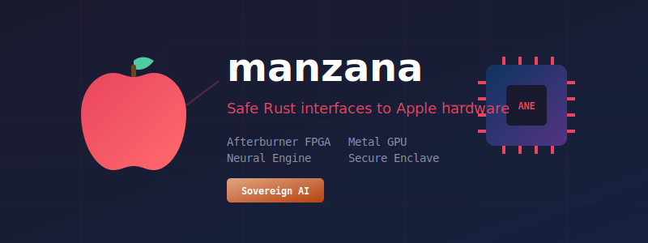

# Manzana

<div align="center">
  

  **Safe Rust interfaces to Apple hardware for Sovereign AI**

  [](https://crates.io/crates/manzana)
  [](https://docs.rs/manzana)
  [](LICENSE)
  []()
</div>

---

## Overview

Manzana (Spanish: "apple") provides **safe, pure Rust interfaces** to Apple hardware subsystems for the Sovereign AI Stack. It enables on-premise, privacy-preserving machine learning workloads on macOS by exposing Apple-specific accelerators through memory-safe abstractions.

## Supported Hardware

| Accelerator | Module | Mac Pro | Apple Silicon | Intel Mac |
|-------------|--------|---------|---------------|-----------|
| Afterburner FPGA | `afterburner` | ✓ | - | - |
| Neural Engine | `neural_engine` | - | ✓ | - |
| Metal GPU | `metal` | ✓ | ✓ | ✓ |
| Secure Enclave | `secure_enclave` | T2 | ✓ | T2 |
| Unified Memory | `unified_memory` | - | ✓ | - |

## Installation

Add to your `Cargo.toml`:

```toml
[target.'cfg(target_os = "macos")'.dependencies]
manzana = "0.1"
```

### Feature Flags

```toml
[features]
default = []
afterburner = []      # Mac Pro Afterburner support
neural-engine = []    # Apple Silicon Neural Engine
metal = []            # Metal GPU compute
secure-enclave = []   # Secure Enclave signing
full = ["afterburner", "neural-engine", "metal", "secure-enclave"]
```

## Quick Start

### Hardware Discovery

```rust
use manzana::{
    afterburner::AfterburnerMonitor,
    metal::MetalCompute,
    neural_engine::NeuralEngineSession,
    secure_enclave::SecureEnclaveSigner,
};

fn main() {
    // Check available accelerators
    println!("Afterburner: {}", AfterburnerMonitor::is_available());
    println!("Neural Engine: {}", NeuralEngineSession::is_available());
    println!("Metal GPU: {}", MetalCompute::is_available());
    println!("Secure Enclave: {}", SecureEnclaveSigner::is_available());
}
```

### Secure Enclave Signing

```rust
use manzana::secure_enclave::{SecureEnclaveSigner, KeyConfig, AccessControl};

fn sign_data() -> manzana::Result<()> {
    // Create a signing key in Secure Enclave
    let config = KeyConfig::new("com.myapp.signing")
        .with_access_control(AccessControl::None)
        .with_label("My Signing Key");

    let signer = SecureEnclaveSigner::create(config)?;

    // Sign data (P-256 ECDSA)
    let message = b"Hello, Sovereign AI!";
    let signature = signer.sign(message)?;

    // Verify
    let valid = signer.verify(message, &signature)?;
    assert!(valid);

    Ok(())
}
```

### Metal GPU Compute

```rust
use manzana::metal::MetalCompute;

fn gpu_compute() -> manzana::Result<()> {
    // Enumerate Metal devices
    let devices = MetalCompute::devices();
    for device in &devices {
        println!("GPU: {} ({:.1} GB VRAM)", device.name, device.vram_gb());
    }

    // Create compute pipeline
    let compute = MetalCompute::default_device()?;

    // Compile shader
    let shader = compute.compile_shader(r"
        kernel void vector_add(
            device float* a [[buffer(0)]],
            device float* b [[buffer(1)]],
            device float* result [[buffer(2)]],
            uint id [[thread_position_in_grid]]
        ) {
            result[id] = a[id] + b[id];
        }
    ", "vector_add")?;

    // Allocate buffers and dispatch
    let buffer_a = compute.allocate_buffer(1024)?;
    let buffer_b = compute.allocate_buffer(1024)?;
    let buffer_result = compute.allocate_buffer(1024)?;

    compute.dispatch(&shader, &[&buffer_a, &buffer_b, &buffer_result], (256, 1, 1), (4, 1, 1))?;

    Ok(())
}
```

### Neural Engine Inference

```rust
use manzana::neural_engine::NeuralEngineSession;

fn neural_inference() -> manzana::Result<()> {
    if NeuralEngineSession::is_available() {
        if let Some(caps) = NeuralEngineSession::capabilities() {
            println!("Neural Engine: {:.1} TOPS, {} cores", caps.tops, caps.core_count);
        }
    }
    Ok(())
}
```

## Examples

Run the included examples:

```bash
# Discover all available Apple hardware
cargo run --example hardware_discovery

# Secure Enclave P-256 ECDSA signing demo
cargo run --example secure_signing

# Metal GPU compute demo
cargo run --example metal_compute
```

## Safety Architecture

Manzana follows a strict safety architecture with all unsafe code quarantined in the FFI layer:

```
+-------------------------------------------------------------+
|                  PUBLIC API (100% Safe Rust)                |
|  #![deny(unsafe_code)]                                      |
|                                                             |
|  +-------------+ +-------------+ +-------------+ +---------+|
|  | Afterburner | |NeuralEngine | |   Metal     | | Secure  ||
|  |   Monitor   | |   Session   | |  Compute    | | Enclave ||
|  +------+------+ +------+------+ +------+------+ +----+----+|
+---------+---------------+---------------+-----------+-------+
          |               |               |           |
          v               v               v           v
  +-----------------------------------------------------------+
  |                  FFI QUARANTINE ZONE                      |
  |  #![allow(unsafe_code)] - Audited, MIRI-verified          |
  |  src/ffi/iokit.rs | src/ffi/security.rs                   |
  +-----------------------------------------------------------+
+---------+---------------+---------------+-----------+-------+
|                   macOS KERNEL / FRAMEWORKS                 |
|  IOKit.framework | CoreML.framework | Metal | Security      |
+-------------------------------------------------------------+
```

## Quality Metrics

| Metric | Value |
|--------|-------|
| Tests | 174 passing |
| Clippy | 0 warnings (pedantic + nursery) |
| Unsafe Code | FFI quarantine only |
| Documentation | 100% public API |

## Use Cases

1. **Afterburner FPGA** (Mac Pro 2019+)
   - ProRes video decode acceleration for ML training data pipelines
   - 23x 4K streams or 6x 8K streams simultaneous decode
   - Real-time stream monitoring via `AfterburnerMonitor`

2. **Neural Engine** (Apple Silicon)
   - CoreML model inference at 15.8+ TOPS
   - Zero-copy with Unified Memory Architecture
   - Privacy-preserving on-device inference

3. **Metal GPU** (All Macs)
   - General-purpose GPU compute
   - Multi-GPU support (Mac Pro dual GPUs)
   - SIMD acceleration

4. **Secure Enclave** (T2/Apple Silicon)
   - P-256 ECDSA signing for model attestation
   - Hardware-bound keys (non-extractable)
   - Biometric authentication support (Touch ID/Face ID)

5. **Unified Memory** (Apple Silicon)
   - Zero-copy CPU/GPU data sharing
   - Page-aligned buffers for Metal
   - Efficient ML tensor management

## Part of the Sovereign AI Stack

Manzana is part of the [Batuta](https://github.com/paiml/batuta) Sovereign AI orchestration stack:

```
+---------------------------------------------------------------------+
|                      BATUTA ORCHESTRATION                           |
|                                                                     |
|  +----------+  +----------+  +----------+  +----------------------+ |
|  | realizar |  | repartir |  | entrenar |  |      manzana         | |
|  | (exec)   |  | (sched)  |  | (train)  |  |  (Apple hardware)    | |
|  +----+-----+  +----+-----+  +----+-----+  +----------+-----------+ |
|       |             |             |                   |             |
|       +-------------+-------------+-------------------+             |
|                           |                                         |
|                    +------v------+                                  |
|                    |   trueno    |                                  |
|                    |  (compute)  |                                  |
|                    +-------------+                                  |
+---------------------------------------------------------------------+
```

## License

MIT License - see [LICENSE](LICENSE) for details.

## References

- [Apple Afterburner](https://support.apple.com/en-us/HT210918)
- [Apple Neural Engine](https://machinelearning.apple.com/research/neural-engine-transformers)
- [Metal Framework](https://developer.apple.com/metal/)
- [Secure Enclave](https://support.apple.com/guide/security/secure-enclave-sec59b0b31ff/web)
- [Unified Memory Architecture](https://developer.apple.com/documentation/metal/resource_fundamentals/choosing_a_resource_storage_mode_for_apple_gpus)
