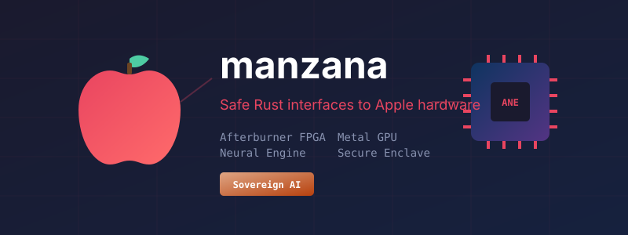

<div align="center">



<h1 align="center">Manzana</h1>

<p align="center">
  <strong>Read-only discovery of Apple accelerator hardware on macOS</strong>
</p>

<p align="center">
  <a href="https://crates.io/crates/manzana"></a>
  <a href="https://docs.rs/manzana"></a>
  <a href="LICENSE"></a>
</p>

</div>

---

Manzana tells you which Apple accelerators are present on the machine it is
running on, and refuses — with a distinguishable error — every operation it
cannot actually perform.

Three things work today: Afterburner FPGA detection and statistics through real
IOKit FFI, Metal GPU enumeration through `system_profiler`, and page-aligned
host buffer allocation. GPU compute, CoreML inference, and cryptography do not.
The full split is in [Capabilities](#capabilities); the fields that look like
device measurements but are not are in [Fields that are not
measured](#fields-that-are-not-measured).

> ### Security
>
> **Manzana implements no cryptography. Do not use it for signing,
> verification, key management, or attestation.**
>
> Versions **0.1.0 and 0.2.0 are yanked** ([RUSTSEC-2026-0273][adv]). Their
> `secure_enclave` module documented hardware-backed P-256 ECDSA and returned
> fabricated values. In 0.3.0 that module is deleted rather than repaired, so
> the crate's cryptographic attack surface is zero. For real Secure Enclave and
> Keychain access, use [`security-framework`][sf].
>
> Details, and what else was fabricated: [The 0.1.0 / 0.2.0
> incident](#the-010--020-incident).

## Contents

- [Capabilities](#capabilities)
- [Fields that are not measured](#fields-that-are-not-measured)
- [Unified memory: two different questions](#unified-memory-two-different-questions)
- [Behavior by host](#behavior-by-host)
- [Installation](#installation)
- [Usage](#usage)
- [Example output](#example-output)
- [Errors](#errors)
- [Feature flags](#feature-flags)
- [Safety architecture](#safety-architecture)
- [Quality](#quality)
- [The 0.1.0 / 0.2.0 incident](#the-010--020-incident)
- [Contributing](#contributing)
- [License](#license)

## Capabilities

This is the current state of the code, not a roadmap. The "Refusal" column
matters: an operation manzana cannot perform does not return a plausible value,
and each one refuses in a specific, documented way.

### Implemented

| What | API | How |
|---|---|---|
| Afterburner presence | `afterburner::is_available` | IOKit `IOServiceGetMatchingService` against the service classes `AppleProResAccelerator`, `AppleAfterburner`, `AFBAccelerator` |
| Afterburner statistics | `AfterburnerMonitor::stats` | `IORegistryEntryCreateCFProperties`, reading the keys `StreamsActive`, `StreamsCapacity`, `Utilization`, `ThroughputFPS`, `Temperature`, `PowerWatts` |
| Metal device enumeration | `MetalCompute::devices` | Parses `system_profiler SPDisplaysDataType`. Device **name** is read from that output |
| Metal VRAM figure | `MetalDevice::max_buffer_length`, `vram_gb` | Parsed from a `VRAM` line **when `system_profiler` prints one**; otherwise a hardcoded default (see below) |
| Neural Engine presence | `neural_engine::is_available` | A compile-time `cfg` check for `target_os = "macos"` **and** `target_arch = "aarch64"` — not a runtime probe. Sound as a presence claim because every Apple Silicon part ships an ANE |
| Page-aligned host allocation | `unified_memory::UmaBuffer` | `std::alloc::alloc_zeroed` at 4096-byte alignment, freed by `Drop`. Works on every platform, macOS or not |
| Tensor construction | `Tensor::new` | Validates `data.len() == prod(shape)` with a checked multiply, so an overflowing shape is rejected rather than wrapping |

Caveats on the Afterburner rows. The end-to-end matrix
(`scripts/e2e_matrix.sh`) is one Linux x86_64 host and one Apple M4, and the
Linux host **is** a Mac Pro 7,1 with an Afterburner card physically fitted
(`lspci`: Apple `106b:0205` at `0f:00.0`) — but it runs Linux, where there is
no IOKit, so manzana cannot read the card there. No host in the matrix can
both see the card and run the code that reads it:

- A registry key that is absent is an error: `stats()` returns `Err`, so no
  snapshot with a stand-in value in it ever reaches you. Until 0.3.0 an absent
  `StreamsCapacity` read as `23` — Apple's marketed figure — indistinguishable
  from an idle card.
- `AfterburnerStats::codec_breakdown` is always an empty map. Nothing populates
  it.

### Not implemented

| What | API | Refusal |
|---|---|---|
| Metal shader compilation | `MetalCompute::compile_shader` | `Error::Unimplemented` — "shader compilation (requires MTLDevice::newLibraryWithSource)" |
| Metal buffer allocation | `MetalCompute::allocate_buffer` | `Error::Unimplemented` — "buffer allocation (requires MTLDevice::newBufferWithLength)" |
| Metal compute dispatch | `MetalCompute::dispatch` | `Error::Unimplemented` — "compute dispatch (requires MTLCommandBuffer/MTLComputeCommandEncoder)" |
| CoreML model loading | `NeuralEngineSession::load` | `Error::Unimplemented` — "CoreML model loading (requires MLModel compileModelAtURL)". A path whose extension is not `.mlmodel` or `.mlmodelc` gets `Error::InvalidInput` first |
| CoreML inference | `NeuralEngineSession::infer` | `Error::Unimplemented` — "inference (requires CoreML MLModel prediction)" |
| ANE capability query (TOPS, cores) | `NeuralEngineSession::capabilities` | Returns `None`, not an error. There is no `Default` on `AneCapabilities`, so `capabilities().unwrap_or_default()` does not compile — it used to hand back the M1's published figures on any machine |
| GPU-visible (zero-copy) memory | `UmaBuffer::is_uma_available` | Returns `false`, not an error. No `MTLBuffer`, `IOSurface`, or Metal call exists anywhere in the crate |
| Cryptography of any kind | — | Removed in 0.3.0 |

Because `load` always fails, no `NeuralEngineSession` can be constructed
through the public API, and `infer` and `model_path` are therefore unreachable
from a caller.

## Fields that are not measured

Enumeration returns a `MetalDevice` whose fields look uniformly like device
properties. Only some of them are. Nothing here is a query to the GPU: manzana
makes no Metal and no IOKit call for Metal devices, and parses one
`system_profiler` report.

| Field | Where the value comes from | Measured? |
|---|---|---|
| `name` | The `system_profiler` output | Yes |
| `index` | Position in the enumeration | Yes (it is a manzana-side index by definition) |
| `max_buffer_length` / `vram_gb()` | A parsed `VRAM` line if present; otherwise a hardcoded 17_179_869_184 (16 GiB) when the device looks like Apple Silicon, or 4_294_967_296 (4 GiB) | Sometimes |
| `registry_id` | Enumeration index + 1 | No — it is not an IOKit registry ID |
| `max_threads_per_threadgroup` | Hardcoded `1024` | No — a published specification figure for current Apple GPUs, never read from the device |
| `is_headless` | Hardcoded `false` | No — `system_profiler SPDisplaysDataType` does not report it |
| `is_low_power` | `true` if the name contains `"Intel"` or `"Integrated"` | No — derived from the name string |
| `has_unified_memory`, `is_apple_silicon()` | `true` if the name contains `"Apple"` **or** the build target is `aarch64` | No — derived from the name and the build target |

On an Apple M4, `vram_gb()` reports exactly 16.0 GiB whatever the machine's
memory, because `system_profiler` prints no `VRAM` line for unified memory and
that figure is manzana's fallback constant. **Read
`MetalDevice::reported_vram_bytes` to tell the two apart:** `Some(bytes)` is
what the report printed, `None` means `max_buffer_length` is the constant and
describes no hardware.

That field is new in 0.3.0, and it exists because both shipped examples used to
print the constant under the label `(from system_profiler)` — a crate constant
presented as a hardware measurement, with a named source. This README carried
that line as captured M4 output while the table above it said the opposite.

`MetalCompute::devices()` spawns `system_profiler` on every call, and
`MetalCompute::is_available()` calls `devices()`. Cache the result if you are
polling.

## Unified memory: two different questions

The examples print `UMA: Yes` in the Metal device panel on an M4 and, further
down, report that manzana cannot give you unified memory. Both are correct,
because they answer different questions:

1. **Does the chip have a unified memory architecture?** On Apple Silicon, yes.
   That is what `MetalDevice::has_unified_memory` reports — though note from the
   table above that it is inferred from the device name and build target, not
   queried.
2. **Can manzana hand you a buffer both the CPU and the GPU can read?** No.
   `UmaBuffer::is_uma_available()` returns `false` on every platform.

`UmaBuffer` is a real page-aligned host allocation, and nothing more. It is not
an `MTLBuffer`, it is not wrapped with `newBufferWithBytesNoCopy:`, and no GPU
can read it. Page alignment is a *precondition* for such a wrap, not the wrap.
The name is retained for API continuity and is itself misleading.

The same distinction is why the crate exposes two top-level predicates:
`is_acceleration_available()` reports hardware **presence** and is `true` on
Apple Silicon; `is_acceleration_usable()` reports whether anything can actually
be done through manzana, and is `true` only where Afterburner statistics are
(unified memory being always `false`). On an M4 they disagree — presence
without usability — which is the honest answer, not a bug.

## Behavior by host

| | macOS, Apple Silicon | macOS, Intel | Any non-macOS host |
|---|---|---|---|
| `is_macos()` | `true` | `true` | `false` |
| `afterburner::is_available()` | IOKit service match | IOKit service match | `false` (no IOKit) |
| `neural_engine::is_available()` | `true` | `false` | `false` |
| `metal::is_available()` / `devices()` | Whatever `system_profiler` reports | Whatever `system_profiler` reports | `false` / empty |
| `unified_memory::is_available()` | `false` | `false` | `false` |
| `UmaBuffer::new(..)` | Works | Works | Works |

Off macOS the crate compiles and every detection path reports absence; it never
invents a device. If `system_profiler` cannot be run or its output yields no
devices, `devices()` returns an empty vector rather than a placeholder GPU.

## Installation

```toml
[dependencies]
manzana = "0.3"
```

The crate builds on any platform — it has no macOS-only build requirement — and
reports absence everywhere but macOS. If you would rather it not appear in
non-Apple builds at all:

```toml
[target.'cfg(target_os = "macos")'.dependencies]
manzana = "0.3"
```

MSRV is 1.75. Dependencies are `thiserror`, `tracing`,
`provable-contracts-macros`, plus `core-foundation`, `core-foundation-sys`, and
`mach2` on macOS targets. `bitflags` and `mach2` are declared in `Cargo.toml`
but not referenced anywhere in `src/`.

## Usage

### Discovery

```rust
use manzana::{
    afterburner::AfterburnerMonitor,
    metal::MetalCompute,
    neural_engine::NeuralEngineSession,
};

println!("Afterburner:   {}", AfterburnerMonitor::is_available());
println!("Neural Engine: {}", NeuralEngineSession::is_available());
println!("Metal GPU:     {}", MetalCompute::is_available());

// Empty on non-macOS hosts, and on macOS hosts where detection fails.
for device in MetalCompute::devices() {
    println!("GPU: {} ({:.1} GB)", device.name, device.vram_gb());
}
```

### Afterburner statistics

```rust
use manzana::afterburner::AfterburnerMonitor;

match AfterburnerMonitor::new() {
    Some(monitor) => match monitor.stats() {
        Ok(stats) => println!(
            "{} / {} streams, {:.1}% utilization",
            stats.streams_active, stats.streams_capacity, stats.utilization_percent,
        ),
        Err(e) => eprintln!("IOKit query failed: {e}"),
    },
    // Normal on any machine without the card, including every Apple Silicon Mac.
    None => println!("no Afterburner"),
}
```

### Page-aligned host buffers

Works on every platform, including Linux:

```rust
use manzana::unified_memory::UmaBuffer;

let mut buffer = UmaBuffer::new(1024 * 1024)?;
assert!(buffer.is_aligned());
assert_eq!(buffer.len(), 1024 * 1024);

buffer.as_mut_slice()[0] = 42;
assert_eq!(buffer.as_slice()[0], 42);

// Rounded up to a 4096-byte boundary; the reported length stays what you asked for.
assert!(buffer.allocated_size() >= buffer.len());
# Ok::<(), manzana::Error>(())
```

### What a refusal looks like

Callers can distinguish "manzana has not implemented this" from every other
failure with `Error::is_unimplemented`:

```rust
use manzana::neural_engine::NeuralEngineSession;
use std::path::Path;

let err = NeuralEngineSession::load(Path::new("model.mlmodelc"))
    .expect_err("CoreML model loading is not implemented");

assert!(err.is_unimplemented());
// Not the same as "the hardware is missing" — the ANE may well be there.
assert!(!err.is_not_available());
assert_eq!(
    err.to_string(),
    "operation not implemented: CoreML model loading \
     (requires MLModel compileModelAtURL) (Neural Engine)",
);

// A caller mistake is reported as a caller mistake, not as a missing backend.
let err = NeuralEngineSession::load(Path::new("model.txt")).unwrap_err();
assert!(!err.is_unimplemented());
assert!(err.to_string().starts_with("invalid input:"));
```

## Example output

Captured by running the examples, not written by hand. Regenerate with:

```bash
cargo run --example hardware_discovery
cargo run --example metal_compute
```

### Linux x86_64 — a MacPro7,1 with an Afterburner card fitted

The card is physically installed (`lspci` shows Apple `106b:0205` at `0f:00.0`)
and manzana still cannot read it, because it reads the card through IOKit and
this host runs Linux. The panel says so, rather than claiming no card:

```text
┌─────────────────────────────────────────────────────────────┐
│ Afterburner FPGA (Mac Pro 2019+)                            │
├─────────────────────────────────────────────────────────────┤
│ Cannot look: manzana reads the card through IOKit, which    │
│ exists only on macOS. A fitted card is unreadable here.     │
│                                                             │
│ Implemented: presence and statistics, read from IOKit.      │
└─
```

`cargo run --example metal_compute` here prints:

```text
╔════════════════════════════════════════════════════════════╗
║          MANZANA - Metal GPU Compute Demo                  ║
╚════════════════════════════════════════════════════════════╝

Metal not available on this system.
Enumeration runs `system_profiler SPDisplaysDataType`, which
reported no GPU here. Requires macOS with a Metal-capable GPU.
```

### Apple M4, macOS 26.5.2

Captured by running `cargo run --example hardware_discovery` on the M4 in the
test matrix. The VRAM line is the point:

```text
┌─────────────────────────────────────────────────────────────┐
│ Metal GPU                                                   │
├─────────────────────────────────────────────────────────────┤
│ Present: yes (1 device(s) enumerated)                       │
│                                                             │
│ GPU 0: Apple M4                                             │
│   VRAM: 16.0 GiB (manzana default, not read)                │
│   Unified memory: yes (name / build target)                 │
│   registry_id, thread limits and headless flag are          │
│   synthesized or hardcoded; see the MetalDevice docs.       │
│                                                             │
│ Implemented: enumeration (name; VRAM when reported).        │
│ Shader compilation, buffer allocation and dispatch are      │
│ not - see the metal_compute example for their refusals.     │
└─────────────────────────────────────────────────────────────┘
```

`system_profiler` prints no `VRAM` line for unified memory, so
`MetalDevice::reported_vram_bytes` is `None` and the panel says the figure is
manzana's default rather than a reading. Until 0.3.0 this same line read
`VRAM: 16.0 GB (from system_profiler)` — a crate constant with a hardware
source attached to it.

`cargo run --example metal_compute` on the same host:

```text
Found 1 Metal device(s):

┌─────────────────────────────────────────────────────────────┐
│ GPU 0: Apple M4                                             │
├─────────────────────────────────────────────────────────────┤
│ Read from system_profiler:                                  │
│   Name:  Apple M4                                           │
│   VRAM:  not reported for this device                       │
│                                                             │
│ Not queried from the device - synthesized or derived:       │
│   VRAM:               16.0 GiB (manzana default, not read)  │
│   Registry ID:        1 (enumeration index + 1)             │
│   Max threads/group:  1024 (hardcoded literal)              │
│   Headless:           false (never determined)              │
│   Low power:          false (from the name string)          │
│   Unified memory:     true (from the name / build target)   │
└─────────────────────────────────────────────────────────────┘

Compute pipeline:
  default_device  -> Apple M4
  compile_shader  -> operation not implemented: shader compilation (requires MTLDevice::newLibraryWithSource) (Metal GPU)
  allocate_buffer -> operation not implemented: buffer allocation (requires MTLDevice::newBufferWithLength) (Metal GPU)
  dispatch        -> cannot be attempted: it takes a CompiledShader
                     and MetalBuffers, and neither can be obtained.
                     Called directly it returns the same refusal.

Enumeration above is real, parsed from `system_profiler`.
Shader compilation, buffer allocation and dispatch are not
implemented: they return Error::Unimplemented on every platform,
for every argument, rather than a value that resembles a result.
See docs/specifications/security-architecture-plan.md
```

The Neural Engine panel prints no TOPS or core count, because `capabilities()`
returns `None` rather than a datasheet figure. `metal_compute` enumerates the
device and then refuses every compute operation:

```text
Compute pipeline:
  default_device  -> Apple M4
  compile_shader  -> operation not implemented: shader compilation (requires MTLDevice::newLibraryWithSource) (Metal GPU)
  allocate_buffer -> operation not implemented: buffer allocation (requires MTLDevice::newBufferWithLength) (Metal GPU)
  dispatch        -> cannot be attempted: it takes a CompiledShader
                     and MetalBuffers, and neither can be obtained.
                     Called directly it returns the same refusal.

Enumeration above is real, parsed from `system_profiler`.
Shader compilation, buffer allocation and dispatch are not
implemented: they return Error::Unimplemented on every platform,
for every argument, rather than a value that resembles a result.
See docs/specifications/security-architecture-plan.md
```

## Errors

Every fallible function returns `Result<T, manzana::Error>`. These are the
variants this crate actually produces:

| Variant | Produced by |
|---|---|
| `Unimplemented` | The five operations in [Not implemented](#not-implemented) |
| `InvalidInput` | `Tensor::new` (length/shape mismatch, or a shape whose product overflows `usize`); `UmaBuffer::new` (zero length, over the 16 GiB maximum, or a length that overflows when page-aligned); `UmaBuffer::copy_from_slice` (source longer than the buffer); `NeuralEngineSession::load` (extension other than `.mlmodel`/`.mlmodelc`) |
| `NotFound` | `MetalCompute::new` with a device index past the end of `devices()` |
| `NotAvailable` | `MetalCompute::default_device` when no Metal device was enumerated |
| `IoKit` | `AfterburnerMonitor::stats` when `IORegistryEntryCreateCFProperties` returns a non-`KERN_SUCCESS` code or a null dictionary. The `kern_return_t` is preserved and readable via `Error::error_code()` |
| `Internal` | `UmaBuffer::new` when the layout is rejected or the allocator returns null |

`Error::Metal`, `Error::CoreMl`, `Error::Timeout`, and
`Error::PermissionDenied` exist with public constructors, but nothing in `src/`
constructs them. Do not write a match arm expecting one.

The predicates `is_unimplemented()`, `is_not_available()`, `is_timeout()`,
`is_permission_denied()`, and `error_code()` support branching without string
matching.

## Feature flags

```toml
default = []
afterburner   = []
neural-engine = []
metal         = []
full = ["afterburner", "neural-engine", "metal"]
```

**These flags gate nothing.** There is no `#[cfg(feature = ...)]` anywhere in
`src/`, so every module compiles regardless of what you enable. Enabling `full`
changes nothing about the resulting binary. The `secure-enclave` flag was
removed in 0.3.0 along with the module it named.

## Safety architecture

The public API is safe Rust. `#![deny(unsafe_code)]` is set at the crate root —
`deny` rather than `forbid` because two files override it:

- **`src/ffi/iokit.rs`** — real FFI. `extern "C"` declarations for
  `IOServiceMatching`, `IOServiceGetMatchingService`, `IOObjectRelease`,
  `IORegistryEntryCreateCFProperties`, and `IORegistryEntryGetName`, linked
  against the IOKit framework, each `unsafe` block carrying a `// SAFETY:`
  justification. This backs Afterburner detection and statistics. It is
  compiled only on macOS; `src/ffi/mod.rs` supplies a non-macOS module that
  reports absence.
- **`src/unified_memory/mod.rs`** — the page-aligned allocation and its RAII
  `Drop`.

Unsafe code is therefore not confined to `src/ffi/`. The `ffi` module is
private and no raw pointer from it escapes into the public API.

`UmaBuffer` uses `alloc_zeroed` rather than `alloc` deliberately: `as_slice`
and `as_mut_slice` are safe public methods, so a caller could build a reference
over uninitialized memory from entirely safe code. Zeroing on allocation makes
the buffer initialized before any reference to it can exist.

## Quality

| Metric | Value |
|---|---|
| Tests | 211 on Linux, 218 on macOS arm64, 0 ignored on both. Those totals are what `cargo test -- --list` reports, which **includes** the 61 doctests — 150 harness tests + 61 doctests on Linux. An earlier row said "214 ... plus 62 doctests" and double-counted them |
| Line coverage | 96.13%, against a 95% floor enforced by `make coverage-gate` |
| Clippy | 0 warnings with `pedantic` + `nursery` on `--all-targets --all-features` |
| Unsafe code | `src/ffi/iokit.rs`, `src/ffi/mod.rs`, `src/unified_memory/mod.rs`, `src/unified_memory/buffer.rs`. This row listed two of the four; the allocator's `alloc_zeroed`/`dealloc` pair lives in `buffer.rs` and an auditor sent to `mod.rs` would not find it |

The counts differ by platform because some tests are gated on `target_os`.
That gap is what `scripts/check_test_census.sh` exists to police, and it is not
a count threshold: it asserts that nothing is ignored, that no module in
`{neural_engine, metal, unified_memory, error, afterburner}` has an empty test
denominator, that the total ratchets monotonically against a committed
baseline, and that any test removed from the name set is named rather than
absorbed by an added one. A `#[cfg(target_os)]`-gated test does not report as
`ignored` on the host that lacks it — it simply does not exist — and a green
lane over zero tests is how the fabricated implementations shipped.

`make tier2` runs formatting, lint, tests, the coverage gate, the security
audit, and contract validation.

## The 0.1.0 / 0.2.0 incident

Recorded here because a stranger evaluating this crate should not have to find
it in a changelog. Full detail in [CHANGELOG.md](CHANGELOG.md); the entries
below are that record, not observations of the current tree, since the code
they describe is deleted.

Both versions are yanked. The `secure_enclave` module documented hardware-backed
P-256 ECDSA signing in `///` rustdoc that sat directly above `//` comments
admitting the implementation was a stub:

- `create()` returned a fixed public key, varying only in one byte set to a
  byte-sum of the key tag. No key was generated.
- `sign()` returned a DER-shaped value whose `r` was 32 copies of a byte-sum of
  the message and whose `s` was 32 copies of a byte-sum of the tag — roughly 8
  bits of entropy per half, derivable by anyone.
- `verify()` re-derived that same value and compared bytes, so it accepted
  forgeries from anyone who knew the tag.
- `delete()` returned `Ok(())` without deleting anything.
- `is_available()` returned `true` unconditionally on macOS, including x86_64
  Macs with no Secure Enclave. The advisory records the affected platform as
  `aarch64`; the defect was broader.

The same pattern existed outside the module named in the advisory:
`neural_engine::infer()` returned a correctly-shaped all-zero tensor silently;
`capabilities()` returned the M1 baseline (15.8 TOPS, 16 cores) on every chip;
`load()` reported success after inspecting only a filename;
`metal::dispatch()` returned `Ok(())` having dispatched nothing;
`metal::compile_shader()` "compiled" by hashing the source string.

**0.3.0 deletes `secure_enclave` rather than repairing it.** Wrapping
`security-framework` would have added no capability while permanently attaching
this advisory to the crate. The remaining fabricating operations now return
`Error::Unimplemented`. What survives of the old shape is documented above under
[Fields that are not measured](#fields-that-are-not-measured) — synthesized
*fields*, labeled as such, rather than fabricated *results*.

Tracked as [RUSTSEC-2026-0273][adv] (`crypto-failure`), reported in
[issue #3](https://github.com/paiml/manzana/issues/3) by
[@ZephyrCodesStuff](https://github.com/ZephyrCodesStuff) and corroborated by
[@djc](https://github.com/djc). Both were right, and the crate is better for it.
Remediation plan:
[`docs/specifications/security-architecture-plan.md`](docs/specifications/security-architecture-plan.md).

## Contributing

Contributions are welcome — open an issue or pull request on
[GitHub](https://github.com/paiml/manzana).

1. Fork the repository and create a branch.
2. Run `make tier2` to validate.
3. Submit a pull request.

**A function must never return a fabricated value.** If an operation cannot
reach the hardware it claims to use, it returns `Error::Unimplemented`. A
plausible-looking placeholder is worse than an error, because a caller cannot
tell it apart from a real result. The same rule governs documentation: a doc
comment is a claim, and a claim nobody checked is how 0.1.0 shipped.

## Security

To report a security issue, open an issue on
[GitHub](https://github.com/paiml/manzana/issues) or contact the maintainers.

Manzana is part of the Sovereign AI stack alongside
[aprender](https://github.com/paiml/aprender).

## License

MIT — see [LICENSE](LICENSE).

## References

- [Apple Afterburner](https://support.apple.com/en-us/HT210918)
- [Apple Neural Engine](https://machinelearning.apple.com/research/neural-engine-transformers)
- [Metal Framework](https://developer.apple.com/metal/)
- [`security-framework`][sf] — for real Secure Enclave and Keychain access

[adv]: https://rustsec.org/advisories/RUSTSEC-2026-0273.html
[sf]: https://crates.io/crates/security-framework
